# Violet Pool Card

<div align="center">

[](https://github.com/Xerolux/VIOLET_CARD_QUICK/releases)
[](https://github.com/hacs/integration)
[](LICENSE)
[](https://github.com/Xerolux/VIOLET_CARD_QUICK/actions/workflows/validate.yml)

Eine Premium-Lovelace-Karte für die [Violet Pool Controller](https://github.com/Xerolux/violet-hass) Integration in Home Assistant.

**[English version below](#english-version)**

</div>

---

## Vorschau

<div align="center">

| Pumpe | Heizung | Solar | Dosierung |
|:-----:|:-------:|:-----:|:---------:|
| 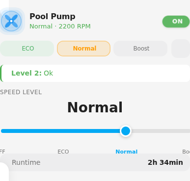 | 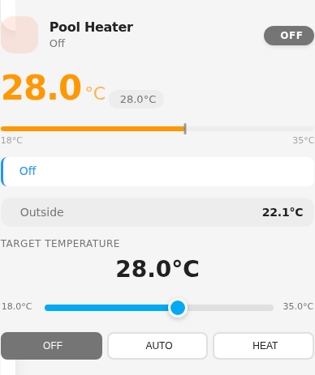 | 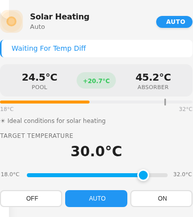 | 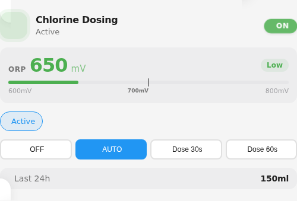 |

| Übersicht | Kompakt | System (Vollbild) |
|:---------:|:-------:|:-----------------:|
| 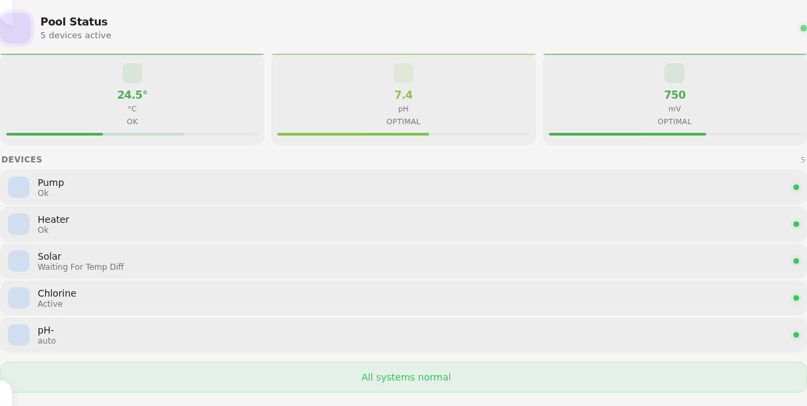 | 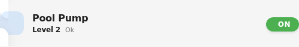 | 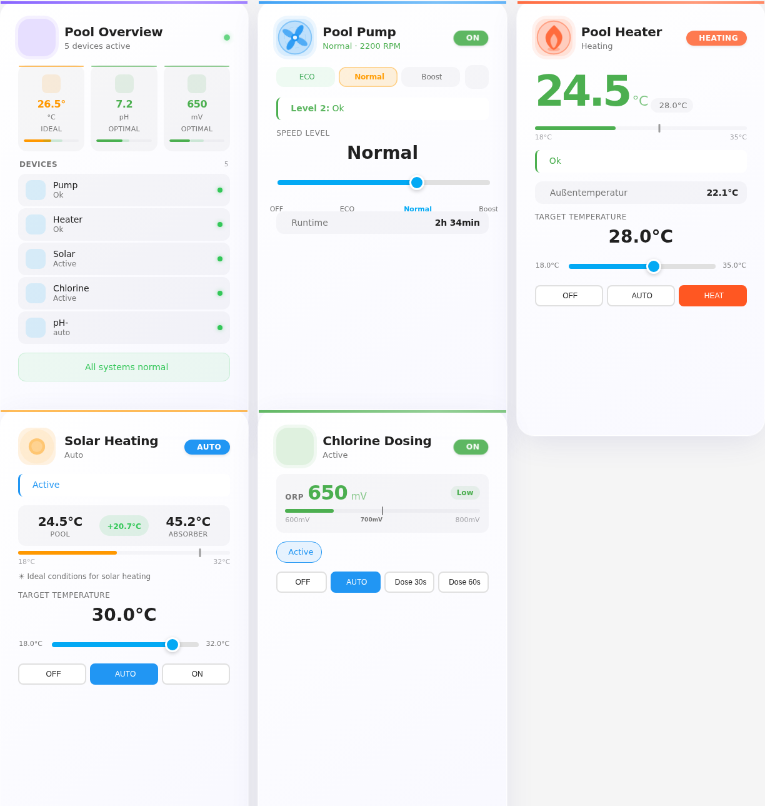 |

</div>

### Themes

<div align="center">

| Luxury | Modern | Glass | Neon | Premium |
|:------:|:------:|:-----:|:----:|:-------:|
| 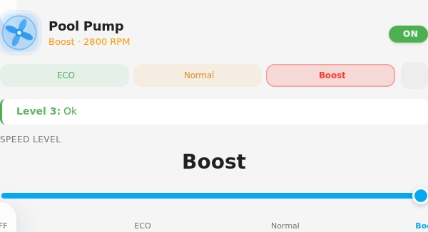 | 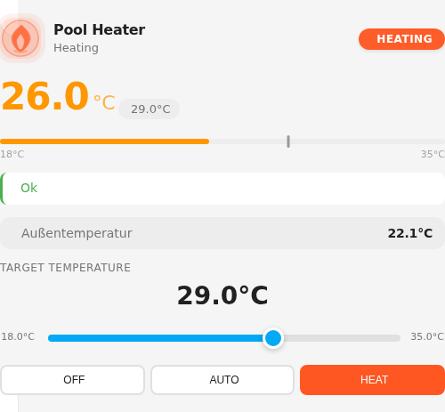 | 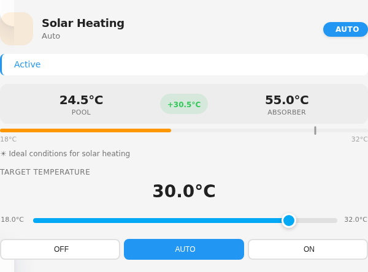 | 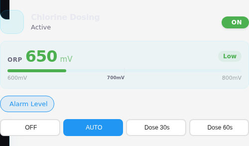 | 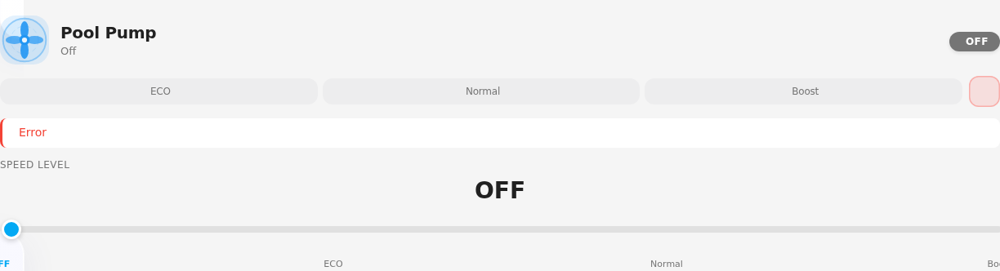 |

</div>

### Kompakt-Varianten

<div align="center">

| Pumpe | Heizung | Solar |
|:-----:|:-------:|:-----:|
| 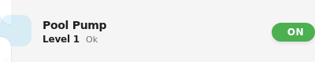 | 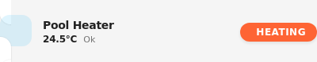 | 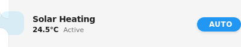 |

</div>

### Vollständiges Dashboard

<div align="center">
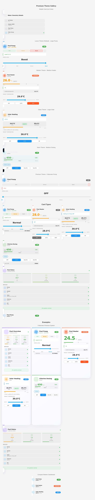
</div>

---

## Funktionen

- **7 Kartentypen** — Pumpe, Heizung, Solar, Dosierung, Übersicht, Kompakt, System
- **Animierte Icons** — rotierende Pumpe, pulsierende Heizung/Dosierung
- **Automatische Erkennung** — Entities, Dosierchemikalien und Sensorwerte werden automatisch erkannt
- **Visueller Editor** — vollständige GUI-Konfiguration, kein YAML nötig
- **Touch-optimiert** — Slider und Quick-Action-Buttons für mobile Bedienung
- **4 Größen** — Small, Medium, Large, Fullscreen
- **6 Themes** — Luxury, Modern, Minimalist, Glass, Neon, Premium
- **3 Animationsstile** — Subtle, Smooth, Energetic
- **Dark/Light Mode** — automatische Anpassung ans HA-Theme
- **Dynamischer Entity-Prefix** — Unterstützung mehrerer Violet Controller
- **Responsive Design** — passt sich an alle Bildschirmgrößen an

---

## Installation

### Voraussetzung

Die [Violet Pool Controller](https://github.com/Xerolux/violet-hass) Integration muss in Home Assistant installiert und eingerichtet sein.

### HACS (Empfohlen)

1. **HACS** öffnen → **Frontend**
2. Drei-Punkte-Menü (oben rechts) → **Eigene Repositories**
3. Repository-URL eingeben: `https://github.com/Xerolux/VIOLET_CARD_QUICK`
4. Kategorie **Dashboard** auswählen → **Hinzufügen**
5. **Violet Pool Card** suchen und installieren
6. Home Assistant **neustarten**

### Manuell

1. `violet-pool-card.js` vom [letzten Release](https://github.com/Xerolux/VIOLET_CARD_QUICK/releases) herunterladen
2. Datei nach `config/www/violet-pool-card.js` kopieren
3. Ressource in Home Assistant hinzufügen:

```yaml
lovelace:
  resources:
    - url: /local/violet-pool-card.js
      type: module
```

4. Home Assistant **neustarten**

---

## Karte zum Dashboard hinzufügen

### Über den visuellen Editor (empfohlen)

1. Dashboard öffnen → **Bearbeiten** (Stift-Symbol oben rechts)
2. **Karte hinzufügen** klicken
3. Nach **Violet Pool Card** suchen
4. Kartentyp, Entity und gewünschte Optionen im Editor auswählen
5. **Speichern**

### Über YAML

1. Dashboard öffnen → **Bearbeiten** → **Karte hinzufügen**
2. Ganz nach unten scrollen → **Manuell**
3. YAML-Konfiguration eingeben:

```yaml
type: custom:violet-pool-card
entity: switch.violet_pool_pump
card_type: pump
```

Die Karte erkennt automatisch zugehörige Entities basierend auf deinem Violet Pool Controller Setup.

---

## Kartentypen

### Pumpe (`pump`)

Geschwindigkeitssteuerung mit OFF/ECO/Normal/Boost-Modi, RPM-Anzeige, animiertes rotierendes Icon und optionaler Laufzähler.

```yaml
type: custom:violet-pool-card
entity: switch.violet_pool_pump
card_type: pump
show_runtime: true
```

### Heizung (`heater`)

Temperaturregler (18–35 °C in 0,5°-Schritten), aktuelle vs. Zieltemperatur, Außentemperatur-Überwachung und Frostwarnungen.

```yaml
type: custom:violet-pool-card
entity: climate.violet_pool_heater
card_type: heater
```

### Solar (`solar`)

Pool- vs. Absorber-Temperatur mit farbcodierten Delta-Hinweisen (rot = zu kalt, gelb = möglich, grün = ideal). Zieltemperatur-Steuerung.

```yaml
type: custom:violet-pool-card
entity: climate.violet_pool_solar
card_type: solar
```

### Dosierung (`dosing`)

Erkennt automatisch den Chemikalientyp (Chlor, pH+/-, Flockungsmittel). Zeigt Ist-/Sollwerte mit korrekter Formatierung (ORP: mV, pH: Dezimal). Schließbare Warn-Chips bei Blockierungen.

```yaml
type: custom:violet-pool-card
entity: switch.violet_pool_dos_1_cl
card_type: dosing
dosing_type: chlorine
show_history: true
```

### Übersicht (`overview`)

Wasserchemie-Dashboard mit Ampelsystem für Temperatur, pH (7,0–7,4) und ORP (650–750 mV). Zeigt aktive Geräte und Warnungen.

```yaml
type: custom:violet-pool-card
card_type: overview
name: Pool Status
```

### Kompakt (`compact`)

Einzeilige Darstellung pro Entity mit automatisch erkannten Icons, Status-Badge und Wertanzeige. Ideal für Sidebar-Dashboards.

```yaml
type: custom:violet-pool-card
entity: switch.violet_pool_pump
card_type: compact
```

### System (`system`)

Vollbild-Dashboard, das alle Kontrollen in einem responsiven Grid kombiniert — Pumpe, Heizung, Solar, Dosierung und Übersicht.

```yaml
type: custom:violet-pool-card
card_type: system
size: fullscreen
```

---

## Konfiguration

### Erforderlich

| Option | Typ | Beschreibung |
|--------|-----|-------------|
| `type` | string | `custom:violet-pool-card` |
| `card_type` | string | `pump` · `heater` · `solar` · `dosing` · `overview` · `compact` · `system` |
| `entity` | string | Entity-ID (nicht nötig bei `overview` und `system`) |

### Darstellung

| Option | Typ | Standard | Beschreibung |
|--------|-----|----------|-------------|
| `name` | string | Auto | Benutzerdefinierter Kartenname |
| `icon` | string | Auto | Benutzerdefiniertes MDI-Icon |
| `size` | string | `medium` | `small` · `medium` · `large` · `fullscreen` |
| `theme` | string | `luxury` | `luxury` · `modern` · `minimalist` · `glass` · `neon` · `premium` |
| `animation` | string | `smooth` | `none` · `subtle` · `smooth` · `energetic` |
| `accent_color` | string | — | Eigene Akzentfarbe (Hex) |
| `icon_color` | string | — | Eigene Icon-Farbe (Hex) |
| `gradient` | string | — | Eigener Farbverlauf |
| `blur_intensity` | number | `10` | Unschärfe-Intensität (0–30) |

### Anzeige-Optionen

| Option | Typ | Standard | Beschreibung |
|--------|-----|----------|-------------|
| `show_state` | boolean | `true` | Status-Badge anzeigen |
| `show_detail_status` | boolean | `true` | Detaillierten Status anzeigen |
| `show_controls` | boolean | `true` | Slider und Buttons anzeigen |
| `show_runtime` | boolean | `false` | Pumpenlaufzeit anzeigen (nur Pumpe) |
| `show_history` | boolean | `false` | Dosierungshistorie anzeigen (nur Dosierung) |

### Erweitert

| Option | Typ | Standard | Beschreibung |
|--------|-----|----------|-------------|
| `entity_prefix` | string | `violet_pool` | Entity-Prefix für Auto-Erkennung |
| `dosing_type` | string | Auto | `chlorine` · `ph_minus` · `ph_plus` · `flocculant` |

### Entity-Überschreibungen

Falls die automatische Erkennung nicht ausreicht, können Entities manuell zugewiesen werden:

| Option | Beschreibung |
|--------|-------------|
| `pump_entity` | Pumpen-Entity |
| `heater_entity` | Heizungs-Entity |
| `solar_entity` | Solar-Entity |
| `chlorine_entity` | Chlor-Dosier-Entity |
| `ph_minus_entity` | pH-Minus-Dosier-Entity |
| `ph_plus_entity` | pH-Plus-Dosier-Entity |
| `pool_temp_entity` | Pool-Temperatur-Sensor |
| `ph_value_entity` | pH-Wert-Sensor |
| `orp_value_entity` | ORP-Wert-Sensor |
| `target_orp_entity` | ORP-Zielwert |
| `target_ph_entity` | pH-Zielwert |

---

## Beispiel: Komplettes Pool-Dashboard

```yaml
type: vertical-stack
cards:
  - type: custom:violet-pool-card
    card_type: overview
    name: Pool Status

  - type: horizontal-stack
    cards:
      - type: custom:violet-pool-card
        entity: switch.violet_pool_pump
        card_type: pump
        show_runtime: true

      - type: custom:violet-pool-card
        entity: climate.violet_pool_heater
        card_type: heater

  - type: horizontal-stack
    cards:
      - type: custom:violet-pool-card
        entity: climate.violet_pool_solar
        card_type: solar

      - type: custom:violet-pool-card
        entity: switch.violet_pool_dos_1_cl
        card_type: dosing
        dosing_type: chlorine
        show_history: true
```

Weitere Beispiele findest du in [VIOLET_CARD_EXAMPLES.yaml](VIOLET_CARD_EXAMPLES.yaml) und der [Schnellreferenz](QUICK_REFERENCE.md).

---

## Unterstützte Entities

Die Karte arbeitet mit folgenden Entity-Typen der Violet Pool Controller Integration:

| Entity | Typ | Beispiel |
|--------|-----|---------|
| Pumpe | `switch` | `switch.violet_pool_pump` |
| Heizung | `climate` | `climate.violet_pool_heater` |
| Solar | `climate` | `climate.violet_pool_solar` |
| Chlor-Dosierung | `switch` | `switch.violet_pool_dos_1_cl` |
| pH-Minus-Dosierung | `switch` | `switch.violet_pool_dos_2_phm` |
| pH-Plus-Dosierung | `switch` | `switch.violet_pool_dos_5_php` |
| Flockungsmittel | `switch` | `switch.violet_pool_dos_6_floc` |
| Pool-Temperatur | `sensor` | `sensor.violet_pool_temperature` |
| pH-Wert | `sensor` | `sensor.violet_pool_ph_value` |
| ORP-Wert | `sensor` | `sensor.violet_pool_orp_value` |
| Freies Chlor | `sensor` | `sensor.violet_pool_free_chlorine` |
| ORP-Zielwert | `number` | `number.violet_pool_target_orp` |
| pH-Zielwert | `number` | `number.violet_pool_target_ph` |

---

## Entwicklung

```bash
git clone https://github.com/Xerolux/VIOLET_CARD_QUICK.git
cd VIOLET_CARD_QUICK
npm install
npm run build        # Produktions-Build
npm run watch        # Dev-Modus mit Auto-Rebuild
npm run serve        # Dev-Server auf localhost:5000
```

---

## Hilfe & Support

- [GitHub Issues](https://github.com/Xerolux/VIOLET_CARD_QUICK/issues) — Fehlerberichte
- [GitHub Discussions](https://github.com/Xerolux/VIOLET_CARD_QUICK/discussions) — Fragen & Diskussionen
- [Violet Pool Controller](https://github.com/Xerolux/violet-hass) — Haupt-Integration

<div align="center">

[](https://www.buymeacoffee.com/xerolux)
[](https://paypal.me/xerolux)
[](https://ko-fi.com/xerolux)

</div>

---

## Mitwirken

1. Repository forken
2. Feature-Branch erstellen (`git checkout -b feature/mein-feature`)
3. Änderungen committen (`git commit -m 'Feature hinzugefügt'`)
4. Branch pushen (`git push origin feature/mein-feature`)
5. Pull Request öffnen

---

## Lizenz

MIT — siehe [LICENSE](LICENSE)

---

## Credits

Gebaut mit [Lit](https://lit.dev/) von [Xerolux](https://github.com/Xerolux)

---

<a id="english-version"></a>

## English Version

### About

A premium Lovelace card for the [Violet Pool Controller](https://github.com/Xerolux/violet-hass) integration in Home Assistant. Features 7 card types (Pump, Heater, Solar, Dosing, Overview, Compact, System), 6 themes, animated icons, smart auto-detection, a visual editor, and responsive design.

### Installation (HACS)

1. Open **HACS** > **Frontend**
2. Click the three dots (top right) > **Custom repositories**
3. Add `https://github.com/Xerolux/VIOLET_CARD_QUICK` as **Dashboard**
4. Install **Violet Pool Card**
5. Restart Home Assistant

### Manual Installation

1. Download `violet-pool-card.js` from the [latest release](https://github.com/Xerolux/VIOLET_CARD_QUICK/releases)
2. Copy to `config/www/violet-pool-card.js`
3. Add the resource:

```yaml
lovelace:
  resources:
    - url: /local/violet-pool-card.js
      type: module
```

4. Restart Home Assistant

### Adding to a Dashboard

1. Open your dashboard > **Edit** (pencil icon, top right)
2. Click **Add Card**
3. Search for **Violet Pool Card**
4. Select card type, entity, and options in the visual editor
5. **Save**

Or use YAML manually:

```yaml
type: custom:violet-pool-card
entity: switch.violet_pool_pump
card_type: pump
```

The card auto-detects related entities based on your Violet Pool Controller setup.

### Quick Start

```yaml
type: custom:violet-pool-card
entity: switch.violet_pool_pump
card_type: pump
```

### Card Types

| Type | Description |
|------|-------------|
| `pump` | Speed control with OFF/ECO/Normal/Boost modes, RPM, animated icon, runtime counter |
| `heater` | Temperature slider (18–35 °C, 0.5° steps), current vs. target, frost warnings |
| `solar` | Pool vs. absorber temperature, color-coded delta hints, target temp control |
| `dosing` | Auto-detects chemical type, current/target values (ORP: mV, pH: decimal), warning chips |
| `overview` | Water chemistry dashboard with traffic-light indicators for temp/pH/ORP |
| `compact` | Single-line display per entity, auto-detected icons, status badge |
| `system` | Full-screen responsive grid combining all controls |

For full configuration options, see the [German documentation above](#konfiguration).
